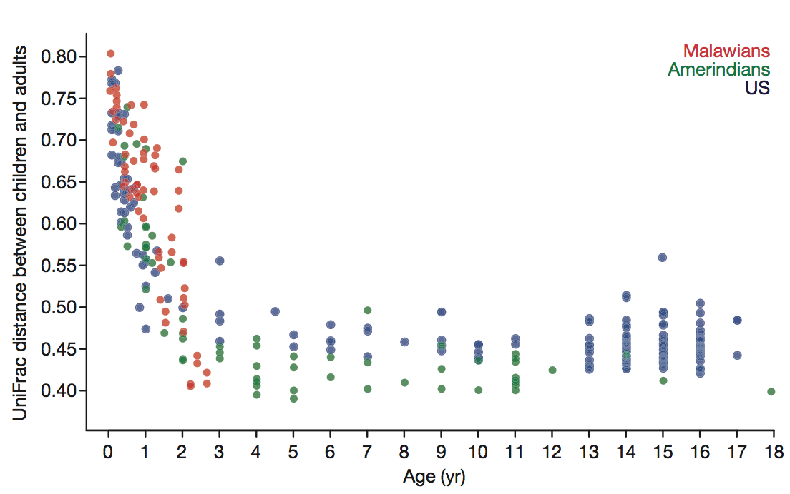
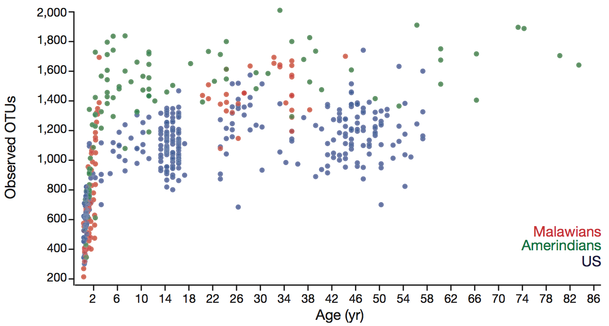
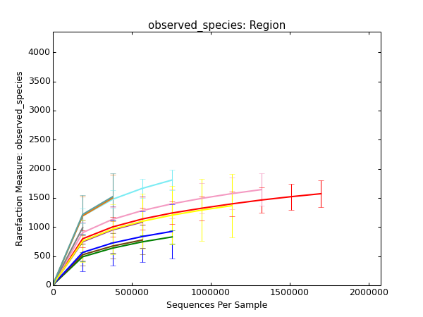
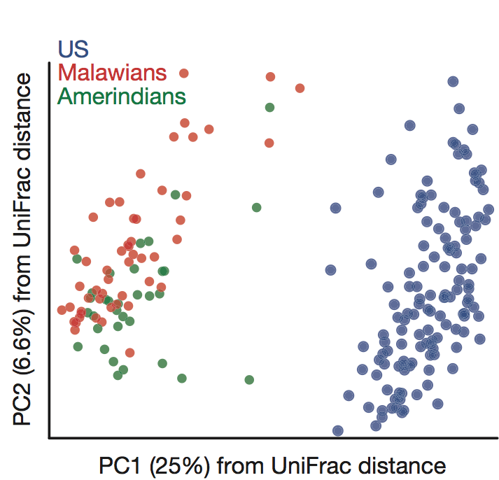
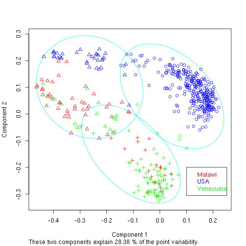
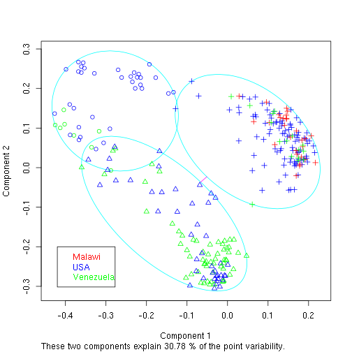
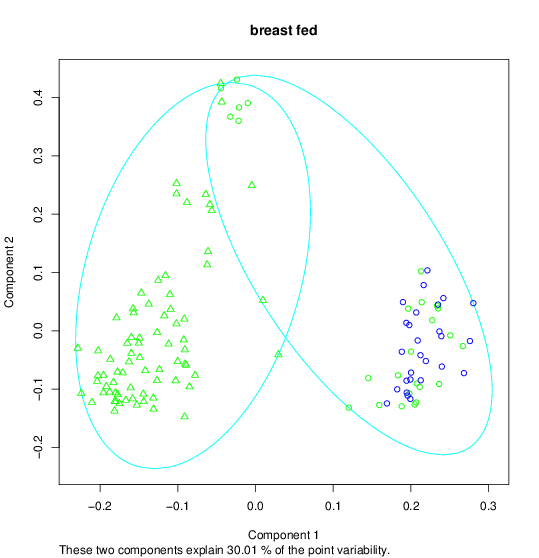

% Practical  Bioinformatics
% Hermann Pauly
% 2014-07-08

<h3>Yatsunenko et al.</h3>  
<h2>**Human Gut Miccobiome Viewed Across Age and Geography**</h2>  
Nature, 2012

# Reminders #

## What was done ##

*	3 populations of all ages

*	microorganism communities from fecal samples
	*	composition
	*	diversity
	*	westernization effects

## Terms and definitions ##

*   **OTU:** grouping of microorganisms by genetic similarity

*   **$\alpha$-diversity:** intra-sample diversity 
	here measured by fraction of shared phylogeny branch (UniFrac)

*   **$\beta$-diversity:** inter-sample diversity 
	here measured by OTU counts

# Microbiome Composition #

## Development of composition ##

Means of $\alpha$-diversity of children to all adults in same country against age

## Number of OTUs ##

## Number of OTUs ##

*   estimated from "rarefaction"
*   rarefaction: subsample to compare richness in samples of different sizes

## Increase of diversity ##

Numbers of OTUs against age

# Westernization #

## Clustering ##

Measure: pairwise $\beta$-diversity of samples

. . . 

What about the linear separation?

## Clustering ##

*   left: linear separation with little errors among adults
*   right: no separation at all among children

## Nutrition ##

## Nutrition ? ##

## Multidimensional separation ##

*   PAM: one-dimensional measure used

*   visually: better separation

*   SVM
	*   supervised learning model
	*   separates datasets with a hyperplane
	*   "kernel trick"

## SVM classification ##

SVM prediction success of adult samples against number of used OTUs, 20-fold cross-validation. Blue: success of PAM.

# My review #

## What went well ##

The 16S rRNA analysis

. . .

*   good process descriptions
*   data available and complete
*   use of publicly available tools
*   lots of supplementary data
*   graphs and results reproducable

## What didn't go well ##

*   some information hard to find
*   incomplete metadata, no mapping
*   no real raw data
*   lack of description and mapping possibility for WGS

## Propositions ##

*   publish raw data and mapping instead of pre-processed "raw data"
*   process data with different tools for comparison
*   absolute vs. relative OTU abundances
*   correspond if you're the corresponding author

# Thank you #
